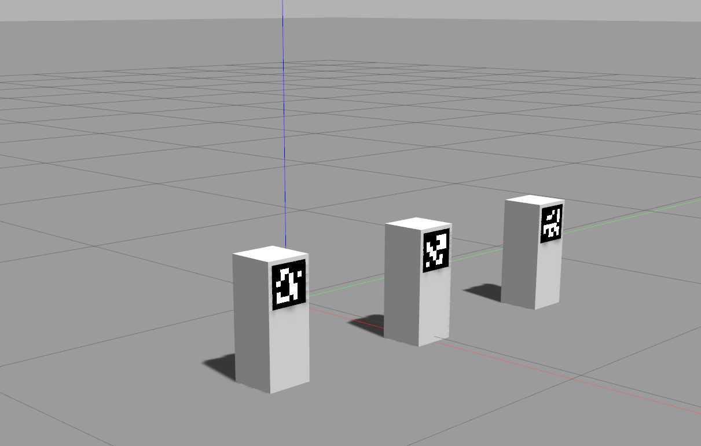

# ArUco Tags in Gazebo

This is an example of how to include [ArUco tags](https://chev.me/arucogen/) in Gazebo.



To try this, clone into a ROS1 workspace (tested with ROS Noetic on Ubuntu 20.04), build, then run

```bash
roslaunch uq_aruco_gazebo gazebo.launch
```

The model of the cuboid is parameterized. From the launch file, you can update

- the pose of the cuboid the ArUco tag is attached to, by updating the arguments passed to the `spawn` nodes
- the dimensions of the cuboid, by passing `dim_x:=0.2` to the xacro parsing (e.g. line 18 in `gazebo.launch`)
- the tag ID, by changing `tag_id:=<ID>` to the xacro parsing. For this to work, the file `6x6_1000_<ID>.png` is expected to be located in `resources/media/materials/textures`.

Helpful links:
- https://classic.gazebosim.org/tutorials?tut=components
- https://answers.ros.org/question/251455/how-do-i-add-texturepng-file-in-urdf/
